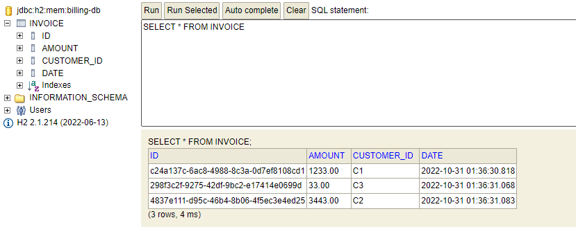

# Billing-service

## la documentation [swagger de cette RestAPI](invoices.pdf).

le programme principal ou on ajoute quelques facture comme des entregistrements de test :
```
@SpringBootApplication
@EnableFeignClients
public class EnsetBillingServiceApplication {

    public static void main(String[] args) {
        SpringApplication.run(EnsetBillingServiceApplication.class, args);
    }
@Bean
    CommandLineRunner start(InvoiceService invoiceService){
        return args -> {
            invoiceService.save(new InvoiceRequestDTO(BigDecimal.valueOf(1233),"C1"));
            invoiceService.save(new InvoiceRequestDTO(BigDecimal.valueOf(33),"C3"));
            invoiceService.save(new InvoiceRequestDTO(BigDecimal.valueOf(3443),"C2"));
        };
}
}

```

base de données :




L'entité Invoice:
```
@Entity
@AllArgsConstructor
@NoArgsConstructor
@Data
public class Invoice {
    @Id
    private String id;
    private Date date;
    private BigDecimal amount;
    private String customerId;
    @Transient
    private Customer customer;
}
```
L'entité Customer :
```
@Data @NoArgsConstructor @AllArgsConstructor
public class Customer {
    private String id;
    private  String name;
    private String email;
}

```
la classe CustomerRestClient qui nous permet de consommer les RestAPI du service customer:
```
@FeignClient(name="CUSTOMER-SERVICE")
public interface CustomerRestClient {


    @GetMapping(path = "/api/customer/{id}")
    Customer getCustomer(@PathVariable(name="id") String id);
    @GetMapping(path ="/api/customers")
    List<Customer> allCustomers();

}
```
l'interface invoiceService :
```
public interface InvoiceService
{
    InvoiceResponseDTO save(InvoiceRequestDTO invoiceRequestDTO);
    InvoiceResponseDTO getInvoice(String invoiceId);
    List<InvoiceResponseDTO> invoicesByCustomerId(String customerId);
    List<InvoiceResponseDTO> allInvoices();

}
```
L'apo Rest pour le microservice Billing-service :
```
@RestController
@RequestMapping(path = "/api")
public class InvoiceRestController {
    private InvoiceService invoiceService ;

    public InvoiceRestController(InvoiceService invoiceService) {
        this.invoiceService = invoiceService;
    }

    @GetMapping(path = "/invoices/{id}")
    public InvoiceResponseDTO getInvoice(@PathVariable(name = "id") String invoiceId){
        return invoiceService.getInvoice(invoiceId);
    }

    @GetMapping(path = "/invoicesByCustomer/{customerId}")
    public List<InvoiceResponseDTO> getInvoicesByCustomer(@PathVariable String customerId){
        return invoiceService.invoicesByCustomerId(customerId);
    }
    @PostMapping(path = "/invoices")
    public InvoiceResponseDTO save (@RequestBody InvoiceRequestDTO invoiceRequestDTO){
        return invoiceService.save(invoiceRequestDTO);
    }

    @GetMapping(path = "/invoices")
    public List<InvoiceResponseDTO> allInvoices(){
        return invoiceService.allInvoices();
    }
    @ExceptionHandler(Exception.class)
    public ResponseEntity<String>  exceptionHandler(Exception e){
        return  new ResponseEntity<>(e.getMessage(),HttpStatus.INTERNAL_SERVER_ERROR);
    }
}

```