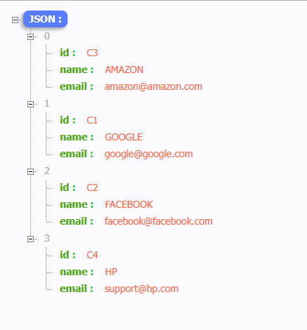
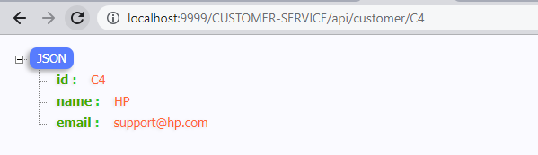
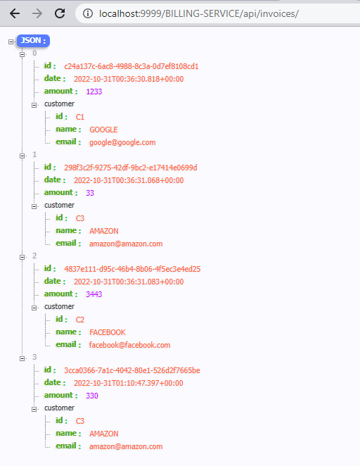
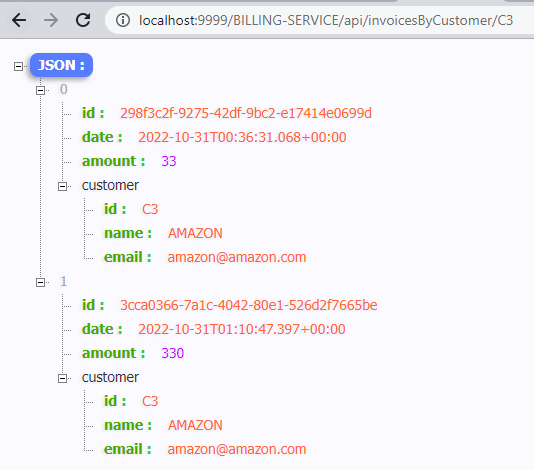

## Gateway  :


la classe principale :
```

@SpringBootApplication
public class GatewayApplication {

	public static void main(String[] args) {
		SpringApplication.run(GatewayApplication.class, args);
	}
	@Bean
	DiscoveryClientRouteDefinitionLocator discoveryClientRouteDefinitionLocator(
			ReactiveDiscoveryClient reactiveDiscoveryClient, DiscoveryLocatorProperties discoveryLocatorProperties
	){
      
		return new DiscoveryClientRouteDefinitionLocator(reactiveDiscoveryClient, discoveryLocatorProperties) ;
	}
}


```

le fichier application.proprieties
```
server.port=9999
spring.application.name=GATEWAY
spring.cloud.discovery.enabled=true
eureka.instance.prefer-ip-address=true

```
tests de consommation des APIRest en passant par la gateway :

pour Customer :


récupération de tous les clients :



récupération d'un par son Id :



pour Invoice :

récupération de toutes las factures :



récupération des factures par son client :



récupération des factures par son Id :

