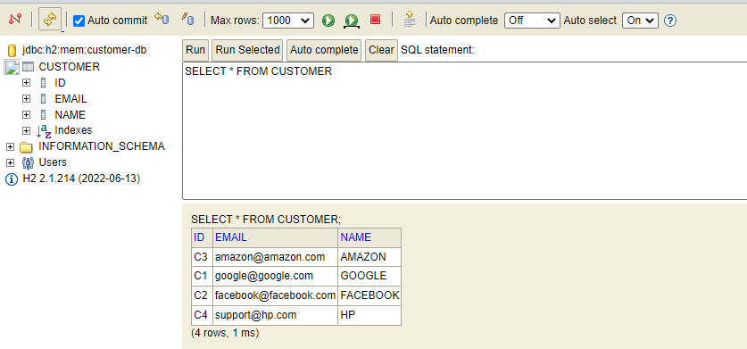

# Customer-service

## la documentation [swagger de cette RestAPI](customer.pdf).

le programme principale ou on ajoute des clients de test :
```
@SpringBootApplication
public class OpenlabCustomerServiceApplication {

    public static void main(String[] args) {
        SpringApplication.run(OpenlabCustomerServiceApplication.class, args);
    }
@Bean
    CommandLineRunner start(CustomerService customerService){
        return args -> {
            customerService.save(new CustomerRequestDTO("C3","AMAZON","amazon@amazon.com"));
            customerService.save(new CustomerRequestDTO("C1","GOOGLE","google@google.com"));
            customerService.save(new CustomerRequestDTO("C2","FACEBOOK","facebook@facebook.com"));
        };
}
}
```

base de données :




l'entité Customer :
```
@Entity
@Data@AllArgsConstructor@NoArgsConstructor
public class Customer {
    @Id
    private String id;
    private String name;
    private  String email;
}

```
L'interface customer service :
```
ublic interface CustomerService {
    CustomerResponseDTO save(CustomerRequestDTO customerRequestDTO);
    CustomerResponseDTO getCustomer(String id);
    CustomerResponseDTO update(CustomerRequestDTO customerRequestDTO);
    List<CustomerResponseDTO> listCustomers();

}
```
la classe RESTAPI :
```
@RestController
@RequestMapping(path = "/api")
public class CustomerRestAPI {
    private CustomerService customerService;


    public CustomerRestAPI(CustomerService customerService) {
        this.customerService = customerService;
    }
    @GetMapping(path = "/customers")
    public List<CustomerResponseDTO> allCustomers(){
        return customerService.listCustomers();
    }


    @PostMapping (path = "/customers")
    public CustomerResponseDTO save(@RequestBody  CustomerRequestDTO customerRequestDTO){
       //customerRequestDTO.setId(UUID.randomUUID().toString());
        return customerService.save(customerRequestDTO);
    }


    @GetMapping(path = "/customer/{id}")
    public CustomerResponseDTO getCustomer(@PathVariable  String id){
        return customerService.getCustomer(id);
    }
}

```

