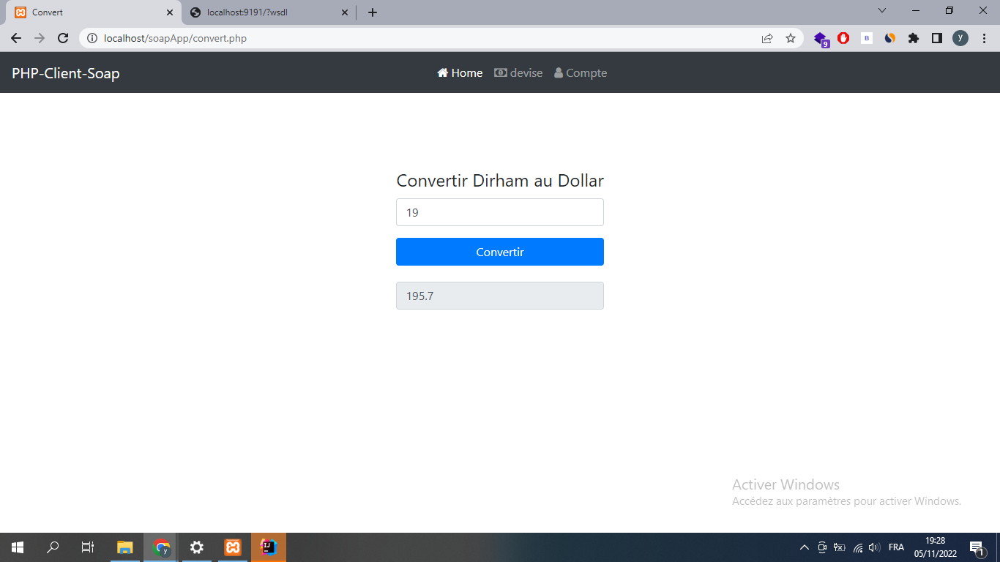
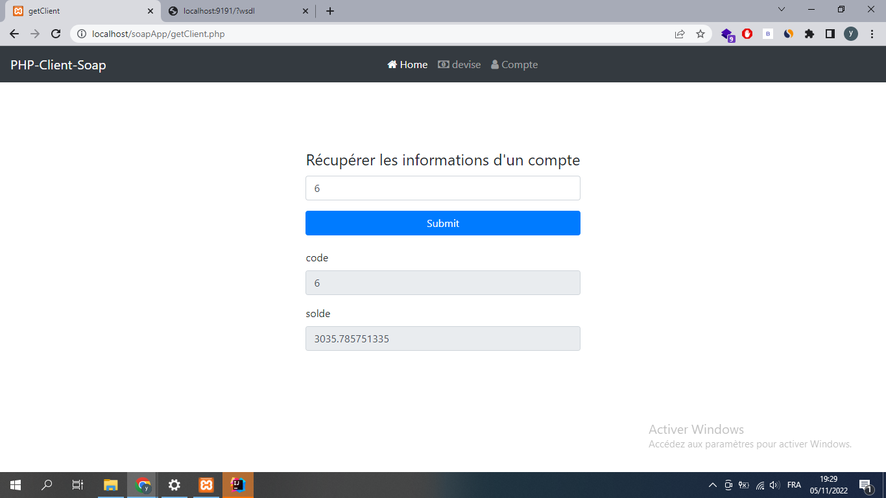
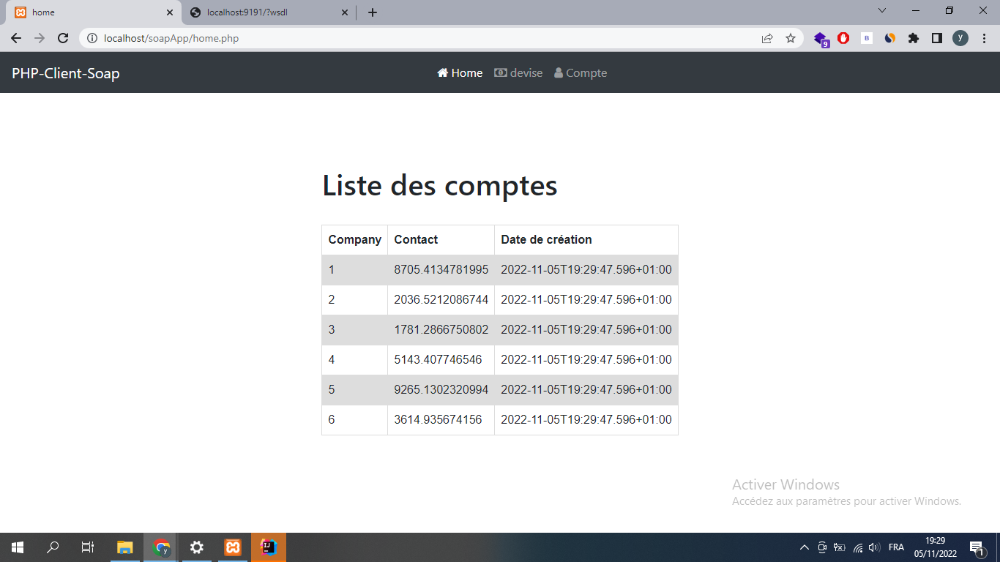
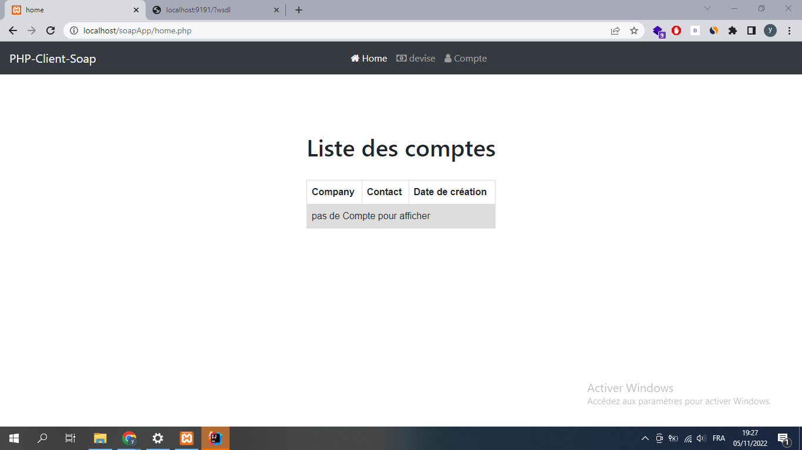

# Architectures orientées services

### php soap client  :

test de la methode Conversion() :

test de la methode getCompte() :

test de la methode listeComptes() -existance des comptes- :

test de la methode listeComptes() -non existance des comptes- :

