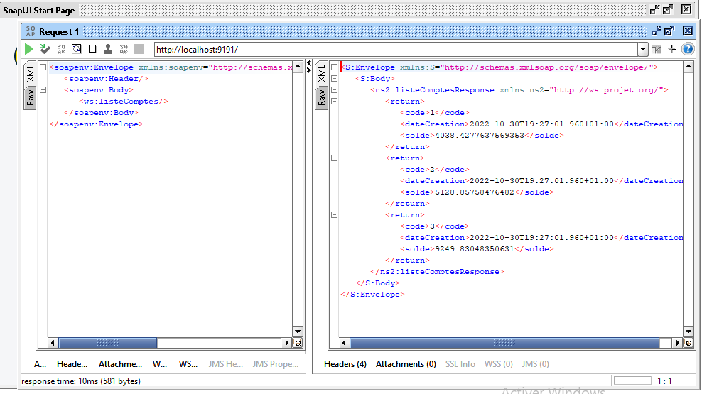
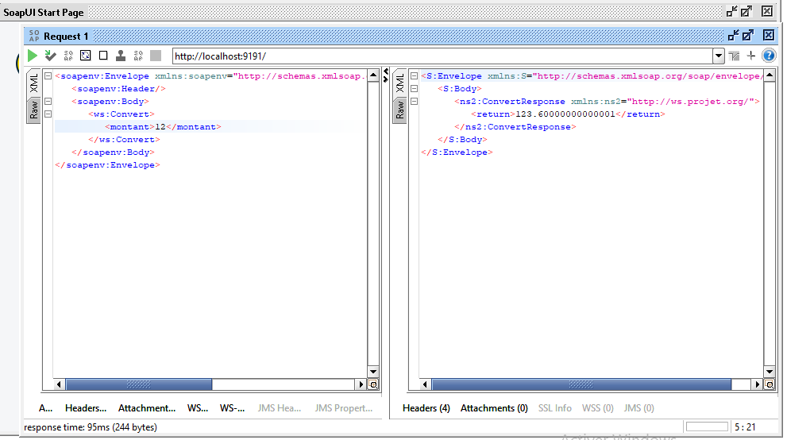

# Architectures orientées services

### Activité Pratique N° 3 : Web services SOAP, WSDL, UDDI avec JAXWS  :

Enoncé :

1.  Voir support ci joint Activité Pratique N°1
   Vidéo à utiliser pour implémenter la solution :
   https://www.youtube.com/watch?v=ig5UHI12HPs
2. Créer un Micro-service Spring boot Multi Connecteurs SOAP,, REST, GRAPHQL qui permet de gérer des comptes

Implémentation :

[🔗 SOAP-WSDL-UDDI](SOAP-WSDL-UDDI)  
[🔗 CLIENT-SOAP-JAVA](client-soap-java)  
[🔗 CLIENT-SOAP-PHP](PHP-Soap-Client)

Test de l'API :

test de la méthode getCompte :

test de la méthode listeComptes :

test de la méthode conversion :

